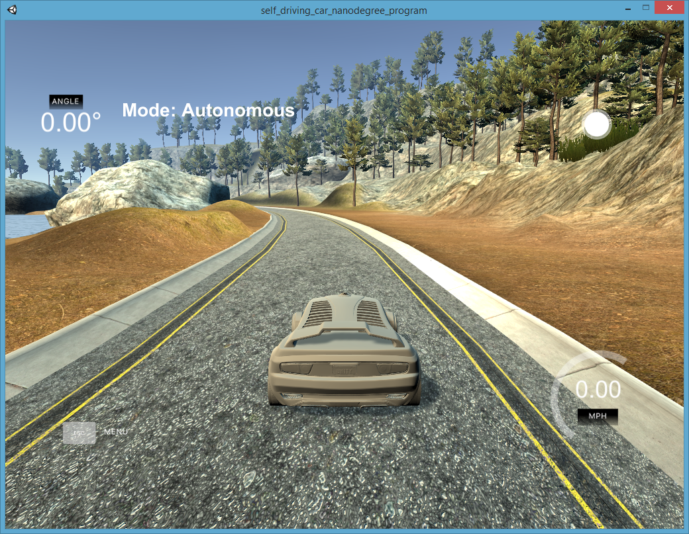

# BehaviorialCloningSDC
Behavioral Cloning project for Udacity Self Driving Car Nanodegree

### Overview
The goal of this project is to train a neural network to drive a car on a track in the Udacity self-driving car simulator. Typical steps in making this happen are:
- Drive the car in the simulator manually and record these driving sessions, to collect the data that can be used for training. The data contains images that the car sees using the frontal cameras, the steering angle, the braking action, the speed and the throttle (overal 3 images and 4 float values captured periodically, and stored as a driving log in a CSV file).
- If the captured data isn't sufficient, augment the data using computer vision techniques. 
- Define the neural network model for steering the car, and train it using the collected/augmented data.
- Test the network using the simulator in the autonomous driving mode, where the network steers the cars on its own based on the inputs from the frontal cameras. 
- The goal is to train the network to be able to drive the car in a reasonably good way, in other words keep the car on the road, do not crash, and drive it in a manner that the passengers in the car would feel comfortable with. 

### Files and directories content
- `model.py` is a Python program that defines the neural network architecture, and trains it using Keras and the driving log data. 
- `model.h5` and `model.json` are the trained model's h5 and json files, respectively. They are created by `model.py` and used by `drive.py` to drive the car in the autonomous mode. 
- `drive.py` is a Python program that uses the trained model to steer the car. This program receives images from the driving simulator, and sends to the simulator the control parameters for the vehicle (steering angle and throttle). 
- `writeup.md` provides more details on the project and analyzes the results. 

### The environment used for this work
The code has been tested using:
- For training the network, Python 3.6.3 under Anaconda3 and Ubuntu 14.04, using GeForce GTX 1080
- For driving the car in the simulator, Python 3.6.3 under Anaconda3 and Windows 8.1
- TensorFlow 1.4.1
- Udacity Self-Driving Car Simulator, available [here](https://github.com/udacity/self-driving-car-sim)

### How to train the neural network to drive
To train the neural network and re-create the trained model, simply run:

`python model.py`

Note that the program points to the dataset used for trahing, which is not supplied in this repository. The dataset is expected to contain the CVS file with the control parameters and the paths to the images of the car's frontal cameras. Udacity provides a basic dataset you can play with, and it is available [here](https://d17h27t6h515a5.cloudfront.net/topher/2016/December/584f6edd_data/data.zip). Please check the directory structure of the dataset and make sure that any additional data you may obtain (through driving the simulator or data augmentation) follows the same structure. 

### How to test the trained model
The best way to test your trained model is to use it with the simulator. Simply start the simulator in the autonomous mode, and then in a separate window run:

`python drive.py model.json`

You can observe that the program establishes the connection with the simulator and the two interact in a way that the simulator sends the camera data from the car to the drive.py program, and in turn the program sends the steering angle and the throttle to the simulator. Effectively, the trained deep neural network used in drive.py drives the car. 

### Where to find more information
- The file `writeup.md` provides more information on the training and testing process. 
- More information on the original assignment can be found in the original [github repository](https://github.com/udacity/CarND-Behavioral-Cloning-P3)

