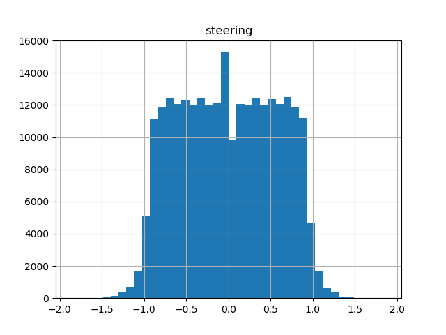
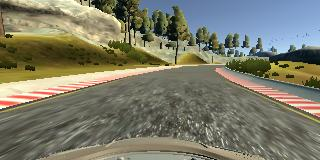
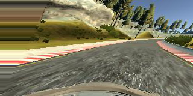
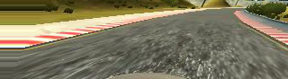
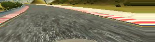
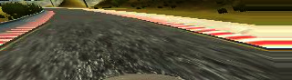
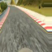
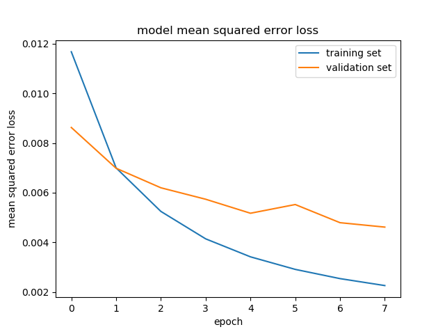

# **Behavioral Cloning Project**
## Writeup / README

This is a summary of the work done to train the neural network to drive a car on a track in the Udacity self-driving car simulator. The Github project is located [here] (https://github.com/bmalnar/BehavioralCloningSDC)

The steps described in the following text include:
1) Dataset exploration and augmentation
2) Training the neural network
3) Testing the neural network in the simulator
4) Generating video of the car driving in the autonomous mode

### Udacity dataset for the project

To get to a quick start, Udacity kindly provides the starting dataset that can be used for initial exploration, i.e. setting up the working environment, training the neural network, and using the trained model with the simulator to get familiar with the process. The dataset can be downloaded [here](https://d17h27t6h515a5.cloudfront.net/topher/2016/December/584f6edd_data/data.zip)

The main file in the dataset is `driving_log.csv`. The header and the first data row of the file are shown below:

```
center,left,right,steering,throttle,brake,speed
IMG/center_2016_12_01_13_30_48_287.jpg, IMG/left_2016_12_01_13_30_48_287.jpg, IMG/right_2016_12_01_13_30_48_287.jpg, 0, 0, 0, 22.14829
```

There are in total 8036 data rows in the file (excluding the header). Each data row contains three images (taken by central, left and right camera mounted at the front end of the car), together with four floating point values for steering, throttle, brake and speed. The goal of the project is to train the neural network to produce the steering angle based on the images of the front facing cameras. The training images listed in the csv file are stored in the IMG directory.  

It is interesting to observe the distribution of the steering angle values over the entire dataset provided by Udacity. This is shown in the following picture. 


We can see that the majority of the data points can be found around the zero steering angle. This is due to the fact that the track that was used to generate the data is mostly flat, so steering is typically close to zero. 

I did try to train the neural network **on this data as-is**, but it didn't work - the car in the autonomous mode would simply lose control in the first curve and go off the road. Apparently the car learned well to go straight, but not really how to make turns. The neural network architecture was probably ok, because I managed to get a good model later with the same network using more data.    

### Collecting more data by running in the simulator

I personally found the simulator very difficult to work with in the "Training" mode, for collecting data. I spent a lot of time trying to keep the car in the middle of the road, but without major success. I ended up driving very slowly, and steering in a way that would probably not be a good set of data for training. I read online that people experienced the same problem and ended up recommending a joystick, whereas I had only the keyboard. Before purchasing a joystick, I decided to give it a shot by using only augmentation approaches based on the dataset provided by Udacity, and it worked, as described in the subsequent sections. 

### Data augmentation

The goal of the data augmentation is to generate additional data for training our model, because what we currectly have might not be enough. In this case, the dataset provided by Udacity contains very few data points around larger steering angles, and many data points around the zero steering angle. We will augment the data to make the final dataset more balanced around all of the steering angle values, and to create more data in general. 

We decided to perform the following data augmentation steps, in this particular order:

1) Random affine transform
2) Image cropping
3) Flipping the image
4) Changing the image brightness
5) Resizing the image

More information on each of these steps will be given in the subsequent sections. After we finish with the data augmentation step, we have a new dataset with the same directory structure as the original dataset provided by Udacity. In other words, all the newly generated images are stored in the directory called `IMG`, and the list of images and the driving parameters is stored in the csv file called `driving_log.csv`. By keeping this structure, we can simply generate different datasets with different augmentation schemes and use them during training to estimate the best augmentation strategy. 

The image below shows the final dataset in terms of the distribution of steering angle values over the entire dataset. Compared to the original Udacity dataset, we can see that we have a better balance of the steering angle values and in general we have more data to use. 



The code to generate this final dataset from the dataset provided by Udacity is simply:

```
python augment_data.py
python filter_augmented_data.py
```

The program `augment_data.py` takes the original dataset and simply creates many more images from it, by applying the aforementioned 5 transofrmations. After running it, the dataset will have many more examples, but the distribution of the number of examples per steering angle will still be very much shifted towards the zero angle. That is why we run `filter_augmented_data.py`, which filters out some of the augmented data points to create a more balanced dataset, as shown in the previous figure. This program goes through all the entries and keeps the entries with a certain probability. If the entry is in the area of the distribution where we have many data points already, the probability that the entry will be discarded is higher. 

### Image processing for data augmentation

The following steps describe the image processing pipeline for data augmentation. We start with a picture from the original dataset and its accompanying steering angle. The original image is shown below, and the steering angle associated with it is 0.02349 



##### Random affine transform

This step is performed first, and the idea is that we will get more data points away from the zero angle. The process is based on the OpenCV function `cv2.warpAffine`, and more information about it can be found [here](https://docs.opencv.org/3.0-beta/doc/py_tutorials/py_imgproc/py_geometric_transformations/py_geometric_transformations.html). A random value is generated for each image to control how much is the image transformed, and in this way we improve the distribution in temrs of the steering angle. Together with the image transofrmation, we have to compute the new steering angle to reflect that transofrmation, and for this test picture it is 0.21447



##### Image cropping

Image cropping is done to eliminate from the image the areas which are not important for learning. For example, the hood of the car at the bottom of the image or the trees at the top do not contribute to learning how to drive. Hence we eliminate 35% of the image from the top, and 10% from the bottom. The width of the image stays the same. 



##### Flipping the image

Flipping the image is done to ensure that we have a more uniform distribution of the steering angle for both left and right turns. For example, if the input dataset contains mostly left turns, the model will not learn well to steer towards right when needed. By flipping the image, we achieve a more uniform distribution for both positive and negative steering angles. The images are flipped with the probability of 50%, meaning that only 50% of the images will be flipped. 



##### Changing the image brightness

The image brightness is changed randomly to ensure that we have a better distribution of brightness, compared to the input dataset. This helps the model to generalize better and achieve good performance at all levels of brightness. 



##### Resizing the image

Finally, the image is resized to 64x64 pixels and stored in a new file, which can later be used for training. As already mentioned, this size of the image allows the model to still learn and perform well, while the size of the model and the speed of training are significantly reduced. 



### The model architecture

The neural network chosen for this work resembles the LeNet network architecture, and has the following layers:

My final model consisted of the following layers:

| Layer         		|     Description	        					| 
|:---------------------:|:---------------------------------------------:| 
| Input         		| 64x64x3 RGB image   							| 
| Lambda         		| Normalize the data (center around zero)   							| 
| Convolution 5x5     	| 2x2 stride, Same padding, 24 output features, relu activation 	|
| Convolution 5x5     	| 2x2 stride, Same padding, 36 output features, relu activation 	|
| Convolution 5x5     	| 2x2 stride, Same padding, 48 output features, relu activation 	|
| Convolution 3x3     	| 1x1 stride, Same padding, 64 output features, relu activation 	|
| Convolution 3x3     	| 1x1 stride, Same padding, 64 output features, relu activation 	|
| Flatten           					|	Flatten the output of the last convolution											|
| Dense	      	| Output vector 1164 wide 				|
| Dense	      	| Output vector 100 wide 				|
| Dense	      	| Output vector 50 wide 				|
| Dense	      	| Output vector 10 wide 				|
| Dense	      	| Single output 				|
 
The single output value represent the steering angle. 
 
#### The training process

For training, several different experiments were performed to investigate the impact of different settings and hyperparameters for achieving the desired accuracy. The list of settings experimented with includes the following:
- **Input data format:** Experimented with different input formats, eventually settled for 64x64x3. Other options include preserving the entire picture size, or just crop without resizing. However, compared to that, 64x64x3 is smaller in terms of size, making the training process faster and the final model smaller in size.   
- **Learning rate:** Used the constant learning rate, but experimented with the value. Eventually settled with 1e-4, which seems to be a good tradeoff between accuracy and speed of the training process.  
- **Optimizers:** Used the Adam optimizer for all experiments, based on previous experience. 
- **L2 loss:** use L2 loss for weights vs. do not use L2 loss. Using L2 loss was a slight winner, improving slight the overall performance of the model during testing. 
- **Number of training epochs:** Experimented with the number of training epochs and observed the training and validation loss. Typically 8-10 epochs produce good results in these experiments. 

The architecture was not changed during these experiments. The approach was to pick a reasonable architecture from the beginning and to try to train it to get the desired accuracy. The architecture can be made deeper, with more layers, but this was eventually not necessary. 

The following picture shows the values of the training and validation loss over 8 epochs of training (indexed in the picture from 0 to 7). Based on the validation loss it appears that 8 epochs is probably enough in this case. 



### Testing the model in the simulator

To test the model in the simulator, the files `model.h5` and `model.json` are needed. First, we start the simulator in the autonomous mode, and then run:

`python drive.py model.json`

We can observe that the simulator and the Python program establish a connection, and eventually the trained model starts to drive the car. The simulator sends the images from the car's frontal cameras to the Python program, where we grab the central image, crop it, and resize it, and then feed it to the trained model to predict the steering angle. This predicted value is sent back to the simulator, meaning that the trained model actually steers the car. The result of the model steering the car for one lap can be observed in the file `video.mp4`

To create the video, we simply use the Python program `video.py` provided by Udacity. To run it, simply do:

`python video.py video_images --fps 30`

The directory `video_images` is where the program `drive.py` stores the images captured during the simulation of autonomous driving. To watch the video, simply download the video file and open it in your favorite video player. 
